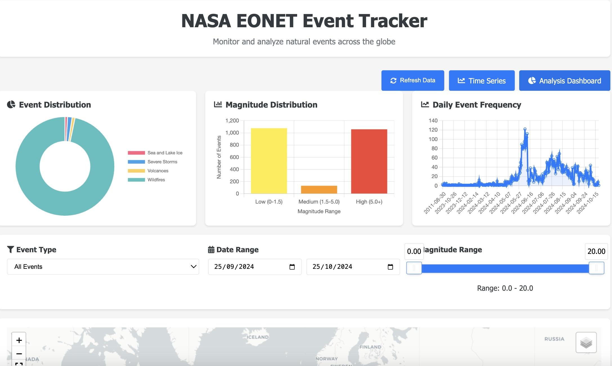
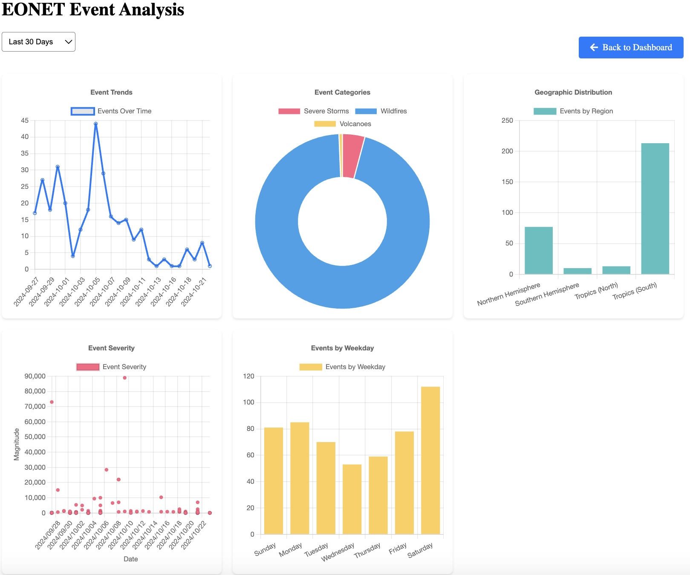
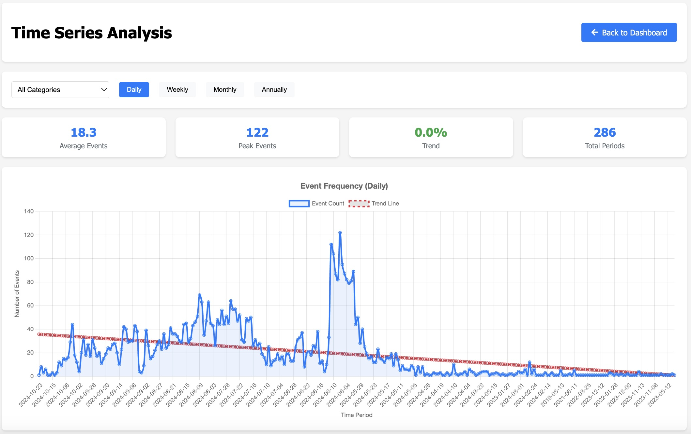

# NASA EONET Event Tracker Dashboard - Interative Dashboard for Global Events

## Overview
The Earth Observatory Natural Event Tracker (EONET) Dashboard is a web application that provides real-time visualization and analysis of natural events across the globe. This application utilizes NASA's EONET API to track and visualize various natural events such as wildfires, earthquakes, volcanic activity, storms, and floods.

## Dashboard


## Features
- **Interactive Global Map**: Visualize events worldwide with color-coded markers
- **Real-time Data**: Fetch and display current natural event data from NASA's EONET API
- **Event Filtering**: Filter events by:
  - Date range
  - Event type
  - Magnitude
- **Data Analysis**:
  - Event distribution analysis
  - Temporal trend analysis
  - Geographic distribution
  - Category-wise analysis
- **Responsive Design**: Works on desktop and mobile devices
## Some Screenshots of the dashboard
 

## Installation

### Prerequisites
- Python 3.11 or higher
- pip (Python package installer)

### Setup
1. Clone the repository
```bash
git clone https://github.com/samuelstrike/eonet_dashboard.git
cd eonet_dashboard
```

2. Create and activate a virtual environment
```bash
# Windows
python -m venv venv
venv\Scripts\activate

# Linux/MacOS
python -m venv venv
source venv/bin/activate
```

3. Install dependencies
```bash
pip install -r requirements.txt
```

4. Run the application
```bash
python app.py
```

The application will be available at `http://localhost:5000`

## Project Structure
```
eonet_dashboard/
├── app.py                  # Main application file
├── requirements.txt        # Project dependencies
├── static/                 # Static files
│   ├── css/               # Stylesheets
│   └── js/                # JavaScript files
└── templates/             # HTML templates
    ├── index.html         # Main dashboard template
    ├── trends.html        # Trends analysis template
    └── analysis.html      # Detailed analysis template
```

## API Endpoints

### Main Endpoints
- `/`: Main dashboard
- `/trends`: Trend analysis
- `/analysis`: Detailed analysis

### API Routes
- `GET /api/events`: Get filtered events
- `GET /api/map`: Get map with filtered events
- `GET /api/summary`: Get summary statistics
- `GET /api/categories`: Get event categories
- `GET /api/trends`: Get trend analysis data

## Usage

### Dashboard
1. Open the main dashboard to view the global map
2. Use filters to narrow down events by:
   - Time period
   - Event type
   - Magnitude range

### Trend Analysis
1. Navigate to the trends page
2. Select time period and categories
3. View temporal patterns and distributions

### Analysis Dashboard
1. Access detailed analysis of events
2. View statistical breakdowns
3. Explore geographic distributions

## Data Sources
- NASA EONET API v3.0: https://eonet.gsfc.nasa.gov/docs/v3

## Contributing
1. Fork the repository
2. Create a feature branch
3. Commit your changes
4. Push to the branch
5. Create a Pull Request

## Credits
- NASA Earth Observatory Natural Event Tracker (EONET)
- Folium for map visualization
- Chart.js for data visualization
- Flask web framework

## License
This project is licensed under the MIT License - see the LICENSE file for details

## Acknowledgments
- NASA for providing the EONET API
- Contributors and maintainers of the open-source libraries used
